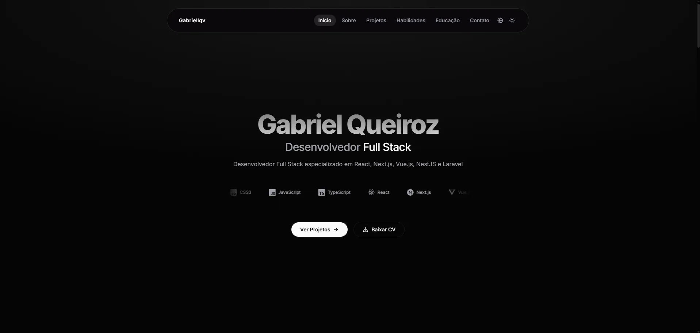

# Portfolio

     


## Overview

A production-ready portfolio application demonstrating advanced web development practices, modern frontend architecture, and strict engineering standards. Built with Next.js App Router, strict TypeScript, and a highly optimized utility-first design system.

1. **Main stack:** Next.js 16, React 19, TypeScript, Tailwind CSS 4, Vitest and React Testing Library.
2. **Highlights:** React Server Components with App Router for optimized performance, dual-theme system (Light/Dark) with glassmorphism, zero-dependency native internationalization (PT/EN), full CI/CD pipeline with GitHub Actions, and WCAG 2.1 compliance with JSON-LD and dynamic Open Graph generation.
3. **Official repository:** [github.com/gabriellqv/portfolio](https://github.com/gabriellqv/portfolio)
4. **Production environment (Live):** [gabriellqv.vercel.app](https://gabriellqv.vercel.app)

## Preview

### Landing Page
<div align="center">
  
  <p><em>Main screen with professional introduction, technology carousel, responsive navigation and theme toggle.</em></p>
</div>

## Results and impact

1. **Optimized performance:** React Server Components via Next.js App Router for server-side rendering and minimized client-side JavaScript bundle.
2. **Full accessibility:** WCAG 2.1 compliance with semantic HTML, keyboard focus traps, `prefers-reduced-motion` fallbacks, and JSON-LD schemas for SEO.
3. **Native internationalization:** Zero-dependency client-side i18n implementation with full support for Portuguese and English.
4. **Automated quality:** CI/CD pipeline via GitHub Actions running type checking, linting, formatting validation, security audits, and automated testing on every pull request.

## Technologies

| Layer | Technology |
|---|---|
| **Framework** | Next.js 16, React 19, App Router, Server Components |
| **Language** | TypeScript 5 (strict mode) |
| **Styling** | Tailwind CSS 4, glassmorphism, hardware-accelerated animations |
| **Theming** | next-themes (Light/Dark) |
| **Icons** | Lucide React, React Icons |
| **Testing** | Vitest, React Testing Library, jsdom |
| **Linting** | ESLint (Flat Config), Prettier |
| **Quality** | Husky, lint-staged, Commitlint (Conventional Commits) |
| **CI/CD** | GitHub Actions (Node 22) |

## Features

1. Responsive navigation with animated mobile menu and smooth scrolling between sections.
2. Hero section with professional introduction and technology carousel.
3. About section with detailed experience and competencies description.
4. Project gallery with interactive cards and links to repositories and live demos.
5. Technical skills grid organized by category.
6. Academic timeline with education and certifications.
7. Contact form with validation and integration.
8. Theme toggle (Light/Dark) with persistence via `next-themes`.
9. Full internationalization (PT/EN) with no external dependencies.
10. Scroll-to-top button with entrance animation.
11. Skip-to-content for keyboard accessibility.

## Technical decisions

1. **App Router and Server Components:** Next.js 16 App Router was adopted to maximize server-side rendering, reducing client-side JavaScript and improving Core Web Vitals metrics.
2. **Dependency-free i18n:** Internationalization was implemented natively with custom hooks, eliminating the overhead of libraries like `next-intl` or `react-i18next`.
3. **Glassmorphism and GPU animations:** Visual effects use `backdrop-filter` and `will-change` for GPU compositing offload, ensuring 60fps on mobile devices.
4. **Strict Conventional Commits:** Commitlint combined with Husky intercepts every commit, ensuring messages follow the semantic pattern before being accepted.
5. **Utilities with clsx + tailwind-merge:** Class composition uses `clsx` for conditionals and `tailwind-merge` for conflict resolution, eliminating duplicate classes.

## Project structure

```
portfolio/
  public/
    portfolio.webp           # Project screenshot
  src/
    app/                     # Next.js App Router (layouts, pages, metadata)
    components/              # Reusable components (Navbar, Button, Footer, ThemeProvider)
      icons/                 # Custom icon components
      __tests__/             # Component unit tests
    sections/                # Page sections (Hero, About, Projects, Skills, Education, Contact)
    constants/               # Application constants
    data/                    # Static data (projects, skills, education)
    hooks/                   # Custom hooks
    i18n/                    # Internationalization system (PT/EN)
    lib/                     # Utilities and helpers
    types/                   # Shared TypeScript interfaces
  .github/workflows/         # CI/CD pipeline
  .husky/                    # Git hooks (pre-commit, commit-msg)
```

## Getting started

### Prerequisites

1. Node.js version 22 or higher.
2. npm version 10 or higher.

### Installation

Clone the repository and install dependencies:

```bash
git clone https://github.com/gabriellqv/portfolio.git
cd portfolio
npm install
```

### Available scripts

| Script | Description |
|---|---|
| `npm run dev` | Starts the development server with Fast Refresh |
| `npm run build` | Compiles the application for production |
| `npm run start` | Starts the production preview server |
| `npm run lint` | Runs ESLint with zero warnings tolerated |
| `npm run format` | Formats all files with Prettier |
| `npm run typecheck` | Validates TypeScript types across the entire project |
| `npm run test` | Runs the Vitest automated testing suite |

## Testing

The test suite covers critical components and interactions with automated execution via GitHub Actions.

```bash
npm run test
```

| Framework | Scope |
|---|---|
| Vitest + React Testing Library | Component and hook unit tests |
| jsdom | DOM simulation environment |

## Code quality enforcement

This project strictly forbids pushing unformatted or broken code. Upon executing a commit, Husky intercepts the action and executes `lint-staged`. This process isolates the staged files and runs Prettier and ESLint. If the files pass formatting and linting, the commit message is parsed by Commitlint to ensure Conventional Commits compliance. If any step fails, the commit is aborted.

## License

This project is licensed under the MIT License.
